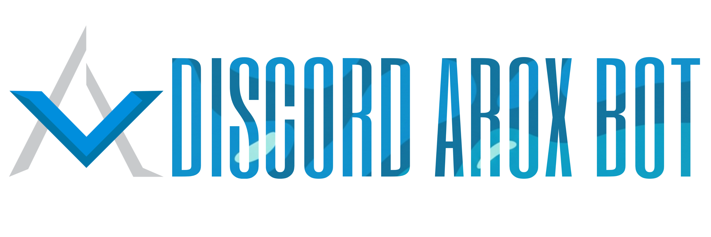

<div align="center">
    
</div>

<div align="center">
    <p>
        <a href="https://opensource.org/licenses/MIT"></a>
        <a href="https://nodejs.org/"></a>
        <a href="https://discord.js.org/"></a>
        <a href="https://aoi.js.org/"></a>
        <a href="https://discord.gg/SQwdQMDz9S"></a>
    </p>
</div>

#### ⚠️ This project represents the legacy source of the **Arox** Discord bot. This source was once actively used but is no longer maintained. The project is developed using the [aoi.js](https://aoi.js.org/) library and provides a comprehensive virtual economy system.

# 🚀 Features
- **Economy System**: Balance management, daily rewards, banking operations, transfers, and leaderboards
- **Market and Shopping**: Purchasing virtual items, inventory management, and stock market simulation
- **Gambling Games**: Coinflip, dice, roulette, rock-paper-scissors, and more
- **Profession System**: Working in different professions to earn income
- **Level System**: User levels and custom backgrounds
- **Multi-Language Support**: English, Turkish, and German languages
- **Admin Commands**: Bot management, maintenance mode, banning, and more
- **Top.gg Integration**: Voting system and webhook support
- **MongoDB Database**: Secure data storage


# 🏗️ Project Structure
```
Arox-Bot/
├── commands/          # Bot commands
│   ├── admin/         # Admin commands
│   ├── economy/       # Economy commands
│   ├── gambling/      # Gambling games
│   ├── general/       # General commands
│   ├── level/         # Level system
│   ├── market/        # Market commands
│   ├── profession/    # Profession commands
│   └── utils/         # Utility commands
├── data/              # Data files (JSON)
├── handler/           # Helper functions and variables
│   ├── functions/     # Custom aoi.js functions
│   └── variables/     # Bot variables
├── index.js           # Main bot file
├── package.json       # Project dependencies
└── README.md          # This file
```

# 📝 Incomplete Updates
- [ ] `commands/market/stock market/stockmarket.js` is not completed.
- [ ] `commands/admin/coinsData.js` is not completed.
- [ ] `commands/general/premium.js` is not completed.

# 📞 Contact
- **GitHub Issues**: [Report Issues](https://github.com/lawerth/Arox-Bot/issues)
- **Discord**: [Support Server](https://discord.gg/SQwdQMDz9S)
- **Email**: lawerth@proton.me

<div align="center">
    <h1>⭐ Star This Project</h1>
    <p>Developed by <a href="https://github.com/lawerth">Lawerth</a> and <a href="https://github.com/fhyrox">Fhyrox</a> for over 2 years ❤️</p>
</div>
